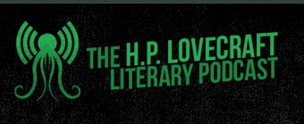
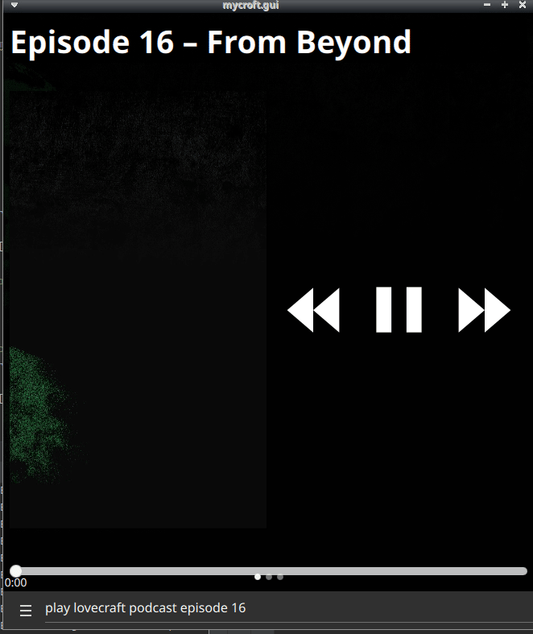

#  The H.P. Lovecraft Literary Podcast 

The H.P. Lovecraft Literary Podcast has been creating podcasts and audio productions since 2009

Listen to the podcasts or selected readings

## About 

Each week, hosts Chad Fifer and Chris Lackey discuss a piece of weird fiction.
Talented voice actors bring the text to life. 
Music and sound effects create atmosphere while occasional guest experts show up to make things classy.

Full story readings are also available alongside podcasts

- THE HAUNTER OF THE DARK by H.P. Lovecraft
- FROM BEYOND by H.P. Lovecraft
- THE PICTURE IN THE HOUSE by H.P. Lovecraft
- THE CATS OF ULTHAR by H.P. Lovecraft
- COOL AIR by H.P. Lovecraft
- THE CALL OF CTHULHU by H.P. Lovecraft
- THE HOUND by H.P. Lovecraft
- THE TEMPLE by H.P. Lovecraft
- PICKMAN’S MODEL by H.P. Lovecraft
- THE STATEMENT OF RANDOLPH CARTER by H.P. Lovecraft
- THE YELLOW WALLPAPER by Charlotte Perkins Gilman
- THE WHISPERER IN DARKNESS by H.P. Lovecraft
- ONE SMALL, VALUABLE THING by Chad Fifer

## Examples 

* "play lovecraft podcast"
* "play lovecraft podcast episode #N"
* "play the temple by lovecraft"
* "read the call of cthulhu"

## Credits 
- JarbasAl
- [The H.P. Lovecraft Literary Podcast](https://hppodcraft.com/)

## Category
**Entertainment**

## Tags
#audio 
#books
#podcasts
#entertainment